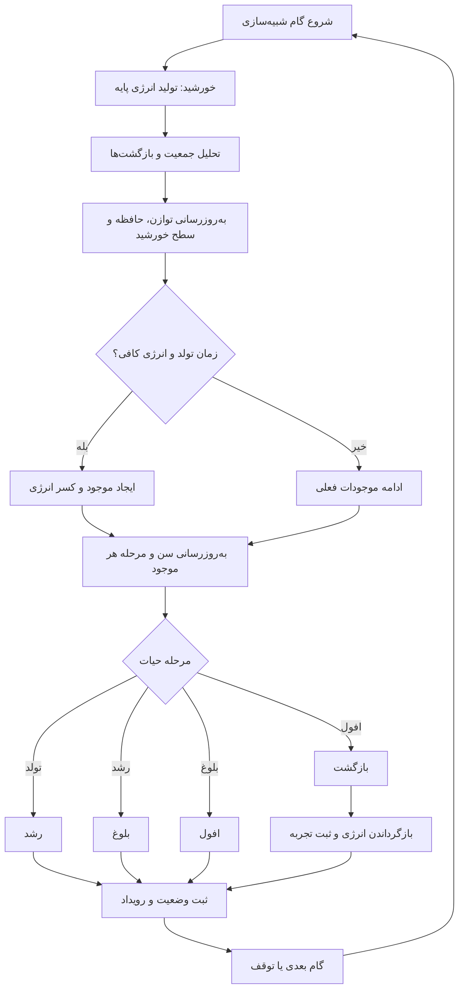

# SunP — شبیه‌ساز نمادین چرخه حیات

نمونه اولیه فارسی و غیرگرافیکی برای آزمودن چرخه نمادین خورشید و موجودات، پیش از ساخت محیط سه‌بعدی. هیچ کتابخانه یا مرحله ساخت لازم ندارد؛ فایل `index.html` را با یک وب‌سرور محلی باز کنید (برای اجرای ES modules از file:// استفاده نکنید).

## الگوریتم چرخه

## مراحل

1. **تولد:** خورشید بخشی از انرژی خود را به موجود تازه می‌دهد.
2. **رشد:** موجود رشد می‌کند و انرژی مصرف می‌کند.
3. **بلوغ:** موجود مدتی پایدار می‌ماند.
4. **افول:** انرژی موجود کاهش می‌یابد.
5. **بازگشت:** موجود از جمعیت فعال خارج می‌شود و انرژی نمادینش به خورشید می‌رسد.
6. **یادگیری خورشید:** خورشید بازگشت‌ها، جمعیت و توازن را در حافظه محدود ثبت می‌کند و سطح/فاصله تولد بعدی را تنظیم می‌کند.

## ساختار

- `src/simulation.js`: موتور مستقل و بدون رابط کاربری؛ `createWorld`, `stepWorld`, `snapshot`
- `src/main.js`: دکمه‌های شروع/توقف، گام‌به‌گام، بازنشانی و سرعت
- `index.html`, `style.css`: رابط فارسی و نمایش وضعیت

## محدودیت مدل فعلی

این یک مدل مفهومی و قطعی با اعداد فرضی است؛ خورشید «AI واقعی» یا شبکه عصبی نیست و خودش را آموزش نمی‌دهد. برای مرحله بعد می‌توان گونه‌ها، منابع محیط، زادآوری، تعاملات، رخدادهای تصادفی کنترل‌شده و سیاست یادگیری قابل ارزیابی را به موتور اضافه کرد. بازگشت به خورشید استعاره‌ای از بازیافت انرژی در مدل است، نه واقعیت علمی.

## مجوز و داده

این پروژه در وضعیت نمونه اولیه است. همه مقادیر و قواعد فعلی فرضی‌اند.
