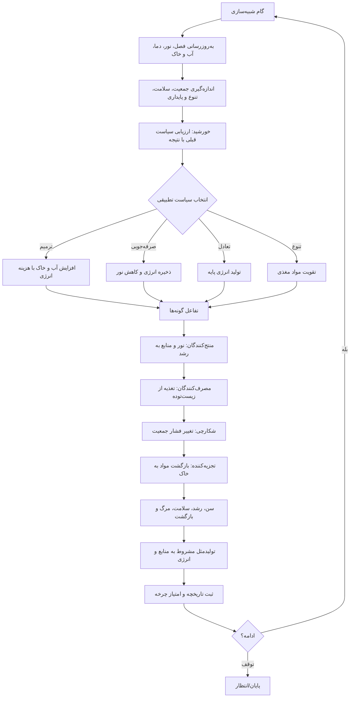

# SunP — شبیه‌ساز نمادین چرخه حیات و اکوسیستم

هسته محاسباتی مستقل از گرافیک، با رابط فارسی مرورگر. همه پارامترها نمادین و قابل توسعه‌اند؛ مدل، واقعیت علمی خورشید یا زیست‌بوم زمین نیست.

## فلوچارت تصمیم‌گیری و چرخه



## گونه‌ها و قواعد

- **تولیدکنندگان:** درخت و گل؛ با نور، آب و خاک انرژی/زیست‌توده می‌گیرند.
- **مصرف‌کنندگان:** گیاه‌خوار، گرده‌افشان، شکارچی و آبزی؛ انرژی و سلامتشان به غذا و فشار جمعیت وابسته است.
- **تجزیه‌کننده:** قارچ؛ مواد مغذی و خاک را بازیابی می‌کند.
- هر موجود شناسه، گونه، مرحله حیات، سن، انرژی، سلامت، رشد، طول عمر، موقعیت نمادین، والد و شمار فرزند دارد.
- چرخه عمر: بذر/تولد ← جوانه ← نابالغ ← بالغ ← پیری ← بازگشت به چرخه مواد.
- فصل، دما، نور، آب، خاک، مواد مغذی و زیست‌توده در هر گام تغییر می‌کنند.
- تولیدمثل فقط با جمعیت زیر سقف و منابع/انرژی کافی ممکن است.
- خورشید سیاست‌های ترمیم، صرفه‌جویی، تعادل و تنوع را با امتیازهای قبلی و وضعیت فعلی انتخاب می‌کند؛ پاداش‌ها در حافظه محدود نگه‌داری می‌شوند. این یک سیاست تطبیقی ساده است، نه شبکه عصبی یا هوش عمومی.
- اگر جمعیت از بین برود و انرژی کافی باشد، خورشید چرخه احیا را با درخت بنیان‌گذار آغاز می‌کند.

## فایل‌ها

- `src/simulation.js`: موتور مستقل؛ `createWorld`, `stepWorld`, `snapshot`, گونه‌ها و مراحل
- `src/main.js`: کنترل‌ها و نمایش زنده شاخص‌ها
- `index.html`, `style.css`: رابط فارسی واکنش‌گرا

## اجرا

برای پشتیبانی از ES modules، با یک وب‌سرور ساده اجرا کنید، مثلاً از ریشه پروژه:

```sh
python3 -m http.server 8000
```

سپس در مرورگر `http://localhost:8000` را باز کنید. اجرای مستقیم از مسیر `file://` ممکن است به‌دلیل محدودیت ماژول‌ها کار نکند.
