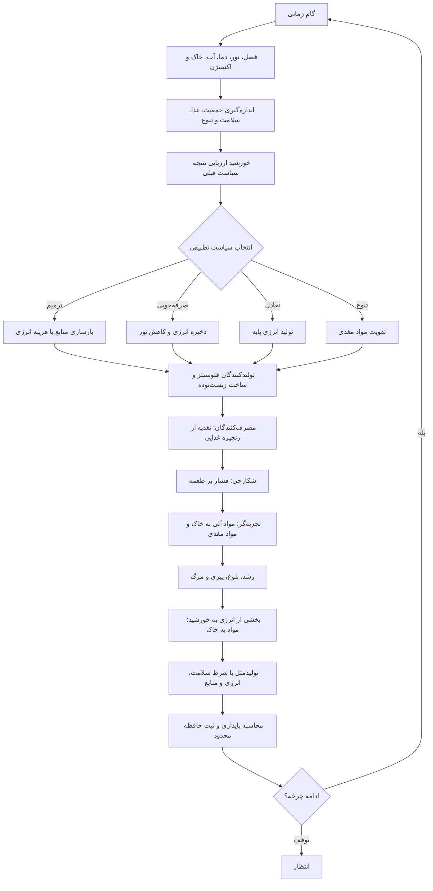

# SunP — شبیه‌ساز چرخه حیات و اکوسیستم

پروژه یک شبیه‌ساز گسسته و قابل بازتولید است. هسته تصمیم‌گیری و تعاملات زیستی از گرافیک جداست؛ Canvas صرفاً وضعیت واقعی مدل را نمایش می‌دهد. واحدها فرضی‌اند و این مدل، بازسازی علمی زمین یا خورشید نیست.

## چرخه اصلی



## الگوریتم و منطق

- **گونه‌ها و نقش‌ها:** درخت و گل تولیدکننده؛ گیاه‌خوار، گرده‌افشان، شکارچی و آبزی مصرف‌کننده؛ قارچ تجزیه‌کننده.
- **هر موجود:** شناسه یکتا، گونه، نقش غذایی، مرحله، سن، طول عمر، انرژی، سلامت، رشد، زیست‌توده، موقعیت، والد و تعداد فرزند دارد.
- **چرخه عمر:** بذر ← جوانه ← نابالغ ← بالغ ← پیری ← بازگشت. پایان عمر یا افت انرژی/سلامت، موجود را از جمعیت فعال خارج می‌کند.
- **تولیدکنندگان:** نور، آب، خاک، دما و رشد روی تولید انرژی و زیست‌توده اثر می‌گذارند.
- **زنجیره غذایی:** مصرف‌کننده‌ها طبق رژیم غذایی تعریف‌شده زیست‌توده را مصرف می‌کنند؛ شکارچی روی مصرف‌کنندگان مشخص اثر دارد. قارچ مواد آلی را به مواد مغذی و خاک بازمی‌گرداند.
- **محیط:** فصل، نور، دما، آب، خاک، مواد مغذی، اکسیژن، زیست‌توده و مواد آلی با گذر زمان تغییر می‌کنند.
- **تولیدمثل:** وابسته به بلوغ، سلامت، انرژی، منابع، سیاست خورشید و سقف جمعیت است.
- **خورشید تطبیقی:** چهار سیاست ترمیم، صرفه‌جویی، تعادل و تنوع دارد. پس از مشاهده پیامد سیاست قبلی، پاداش تقریبی را به‌روزرسانی می‌کند و با ترکیب ارزش آموخته‌شده، نیاز فعلی محیط و اکتشاف کنترل‌شده، انتخاب می‌کند. حافظه محدود است.
- **بازگشت و احیا:** بخشی از انرژی باقی‌مانده موجود در مدل به شاخص انرژی خورشید می‌رود؛ زیست‌توده و مواد مغذی به محیط برمی‌گردند. اگر جمعیت نابود شود و انرژی کافی باشد، خورشید می‌تواند درخت بنیان‌گذار ایجاد کند.
- **شاخص سلامت اکوسیستم:** ترکیبی از توازن جمعیت، سلامت موجودات، منابع، دسترسی غذایی و تنوع گونه‌ای است؛ امتیاز تشخیصی مدل است، نه حقیقت علمی.
- **تکرارپذیری:** مولد تصادفی بذرپذیر است؛ اجرای دو جهان با بذر یکسان باید نتیجه یکسان بدهد.

این کنترل‌گر یک عامل تطبیقی نمادین و قابل توضیح است، نه هوش عمومی یا شبکه عصبی. برای ادعای زیست‌شناختی معتبر، لازم است پارامترها با داده‌های واقعی کالیبره و اعتبارسنجی شوند.

## صحنه زنده

خورشید، حلقه زودیاک، مسیرهای انرژی، جزیره، آب، درخت حیات و موجودات با Canvas دوبعدی نمایش داده می‌شوند. موقعیت و مرحله موجودات از همان وضعیت موتور می‌آید؛ با کلیک روی موجود، اطلاعاتش دیده می‌شود. گرافیک نقش نمایشی دارد و منطق را تعیین نمی‌کند.

## فایل‌ها

- `src/simulation.js`: موتور مدل، سیاست تطبیقی و تشخیص وضعیت
- `src/scene.js`: صحنه Canvas
- `src/main.js`: داشبورد و کنترل‌ها
- `tests/simulation.test.js`: آزمون‌های تکرارپذیری، کران منابع و اجرای طولانی
- `package.json`: فرمان آزمون

## اجرا و آزمون

```sh
npm test
python3 -m http.server 8000
```

سپس `http://localhost:8000` را باز کنید. اجرای مستقیم از `file://` ممکن است به‌دلیل ماژول‌های ES کار نکند. گردش‌کار GitHub Pages اکنون قبل از انتشار آزمون‌ها را اجرا می‌کند.
   
